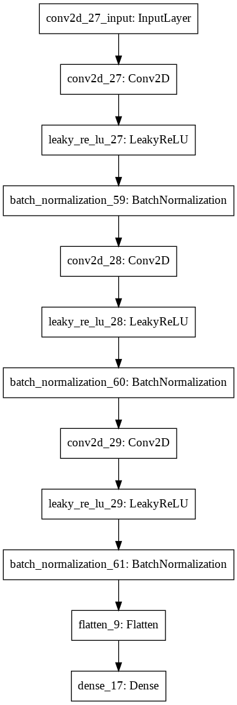
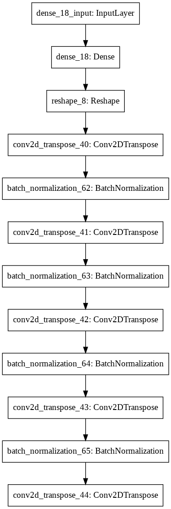
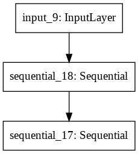

# Deepfaking Numbers using Keras
 
### Discriminator Model

 
### Generator Model

### GAN Model

## Number 0
### Accuracy and Loss                                   

### Epoch 1

### Epoch 99

## Number 1
### Accuracy and Loss                                   

### Epoch 1

### Epoch 99

## Number 2
### Accuracy and Loss                                   

### Epoch 1

### Epoch 85

## Number 3
### Accuracy and Loss                                   

### Epoch 1

### Epoch 97

## Number 4
### Accuracy and Loss                                   

### Epoch 1

### Epoch 97

## Number 5
### Accuracy and Loss                                   

### Epoch 1

### Epoch 96

## Number 6
### Accuracy and Loss                                   

### Epoch 1

### Epoch 92

## Number 7
### Accuracy and Loss                                   

### Epoch 1

### Epoch 100

## Number 8
### Accuracy and Loss                                   

### Epoch 1

### Epoch 51

## Number 9
### Accuracy and Loss                                   

### Epoch 1

### Epoch 100

